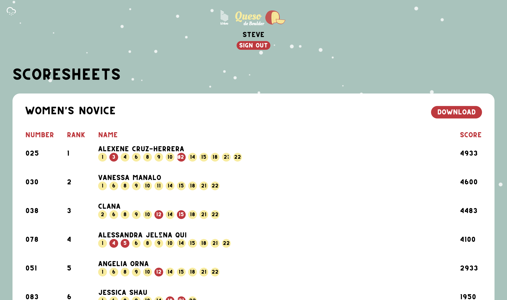
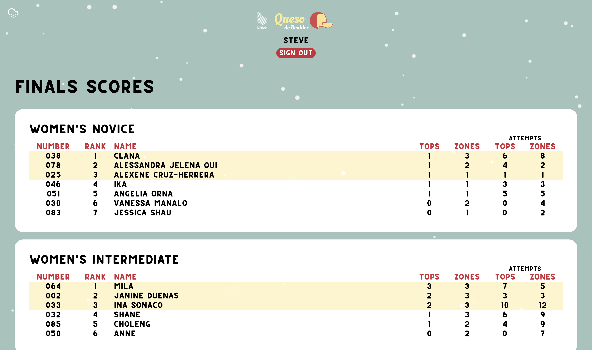
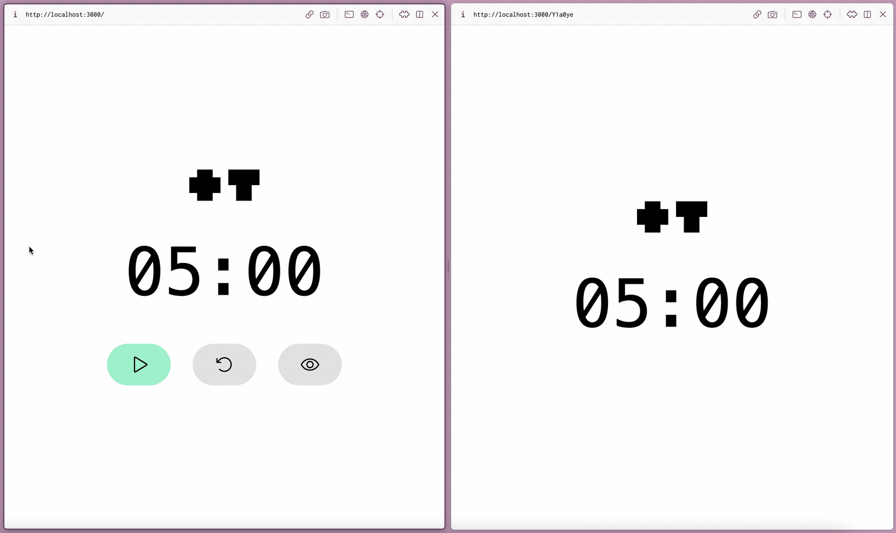

# Tallytop

Makes organizing climbing competitions fun.

## Note for Launch Week 6 Judges

This submission was supposed to have a bigger scope. I built an app for a local fun climbing competition a few weeks ago. It's a Remix app using Supabase Auth, Database, and Realtime.

Features included:
| Feature                                                                                                                                                                                                                                                                                                                       | Demo                                                 |
| ----------------------------------------------------------------------------------------------------------------------------------------------------------------------------------------------------------------------------------------------------------------------------------------------------------------------------- | ---------------------------------------------------- |
| - Record your own tops via QR codes.<br />- Track your current tops.<br />- Automatic tallying of scores for Qualifiers. This round featured a dynamic score system where the points you get from a boulder problem is divided by the number of competitors that topped it. I also used Realtime to make the scoreboard live. |              |
| Timer customized to the rounds of the comp.                                                                                                                                                                                                                                                                                   |                     |
| Generate finals scoresheets for judges.                                                                                                                                                                                                                                                                                       |  |
| Record finalist scores.                                                                                                                                                                                                                                                                                                       |   |
| Automatic tallying of scores for finals.                                                                                                                                                                                                                                                                                      |     |


I wanted to remove the comp branding and make improvements to the timer app before submitting it as my entry for the hackathon. But then SvelteKit 1.0 got announced and I of course started rewriting everything right away. Parts for my climbing wall also arrived so I got occupied by that as well.

You can still access this initial Remix version (https://qdb.tallytop.com/) and I kept its code in a separate branch (https://github.com/marksteve/tallytop/tree/qdb2022). But I worked on this last week of November so I'm guessing it won't qualify for Launch Week.

So without much time over the weekend to work with, I was only able to finish the rewritten timer that uses the new multiplayer features for a view mode that syncs up with them main one:



### Apps and Packages

- `timer`: Configurable timer (https://timer.tallytop.com)
- `ui`: Component library shared by all applications
- `eslint-config-custom`: `eslint` configurations 

### Build

To build all apps and packages, run the following command:

```
pnpm run build
```

### Develop

To develop all apps and packages, run the following command:

```
pnpm run dev
```
